# ClasificadorDeImagenesDesdeCero (Proyecto Mascarilla)

> **Asignatura:** Fundamentos de Programación Concurrente y Distribuida  
> **Docente:** Prf. Alejandro Jaimes  
> **Fecha:** 26/06/2026  
> **Repositorio:** [https://github.com/Datians/ProyectoFinal-ClasificadorDeImagenesDesdeCero]()

---

## Equipo

| | Colaborador | GitHub |
|---|---|---|
| 👤 | Juan David Miranda Pelaez | [Gal4h4d](https://github.com/Gal4h4d) |
| 👤 | Cristhian David Parra Parada | [CristhianParada](https://github.com/CristhianParada) |
| 👤 | Andres Cuadrado | [Datians](https://github.com/Datians) |
| 👤 | Julio Martínez Triana | [Julsdev](https://github.com/JulssDev) |

## Proyecto y dataset

## Arquitectura de la red
Se implementó una red neuronal completamente conectada (Fully Connected Neural Network) utilizando CUDA para acelerar el entrenamiento y la inferencia sobre GPU.

La arquitectura está compuesta por tres capas principales:

```
Entrada (64x64 = 4096)
        │
        ▼
Capa Oculta (256 neuronas)
        │
      ReLU
        │
        ▼
Capa de Salida (10 neuronas)
        │
     Softmax
        │
        ▼
Predicción Final
```

La red recibe imágenes de **64 × 64 píxeles**, las cuales son transformadas en un vector de **4096 características** antes de ser procesadas.

Durante el entrenamiento se emplea:

- Función de activación ReLU en la capa oculta.
- Función Softmax en la capa de salida.
- Descenso por gradiente (Gradient Descent).
- Función de pérdida Cross-Entropy.
- Implementación paralela mediante CUDA.

---

## 2. Capas, tamaños, activaciones y número total de parámetros entrenables

### Configuración del conjunto de datos

El modelo fue entrenado utilizando un conjunto de **700 imágenes** distribuidas de la siguiente forma:

| Conjunto | Cantidad | Porcentaje |
|----------|---------:|-----------:|
| Entrenamiento | 490 | 70 % |
| Validación | 105 | 15 % |
| Prueba | 105 | 15 % |

Todas las imágenes poseen una resolución de:

```
64 × 64 píxeles
```

Por lo tanto, cada imagen produce un vector de entrada de:

```
64 × 64 = 4096 características
```

---

### Arquitectura del modelo

| Capa | Tamaño | Activación |
|------|--------|------------|
| Entrada | 4096 neuronas | — |
| Oculta | 256 neuronas | ReLU |
| Salida | 2 neuronas | Softmax |

---

### Parámetros entrenables

#### Capa Entrada → Oculta

Número de pesos:

```
4096 × 256 = 1 048 576
```

#### Capa Oculta → Salida

Número de pesos:

```
256 × 10 = 2 560
```

---

### Total de parámetros entrenables

| Conexión | Parámetros |
|----------|-----------:|
| Entrada → Oculta | 1 048 576 |
| Oculta → Salida | 2 560 |
| **Total** | **1 051 136** |

> **Nota:** En esta implementación únicamente se entrenan las matrices de pesos (`W1` y `W2`). No se utilizan vectores de sesgo (bias), por lo que estos no forman parte de los parámetros entrenables.

---

## Métricas finales

Las métricas fueron calculadas utilizando el conjunto de prueba compuesto por **105 imágenes**, el cual no participó durante el entrenamiento del modelo.

Las métricas de evaluación consideradas son:

- Exactitud (Accuracy)
- Precisión (Precision)
- Recall
- F1-Score
- Matriz de Confusión

---

## Métricas de CPU

### Precisión (Precision) - CPU

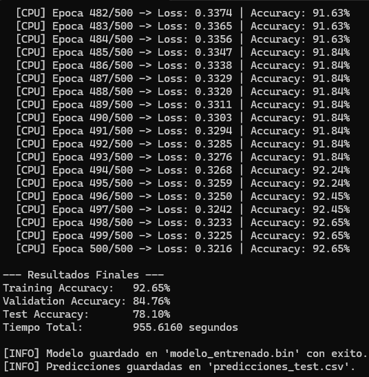

---

### F1-Score y otras métricas - CPU

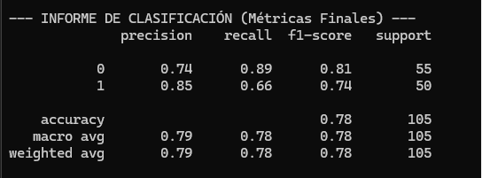

---

### Matriz de Confusión - CPU

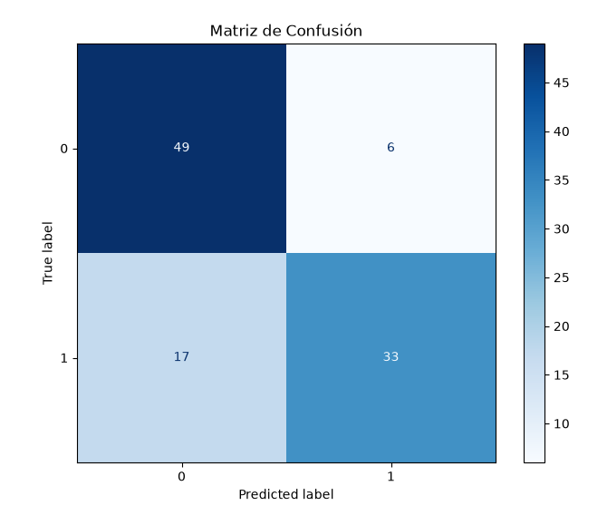

---

## Métricas de GPU (CUDA)

### Precisión (Precision) - GPU

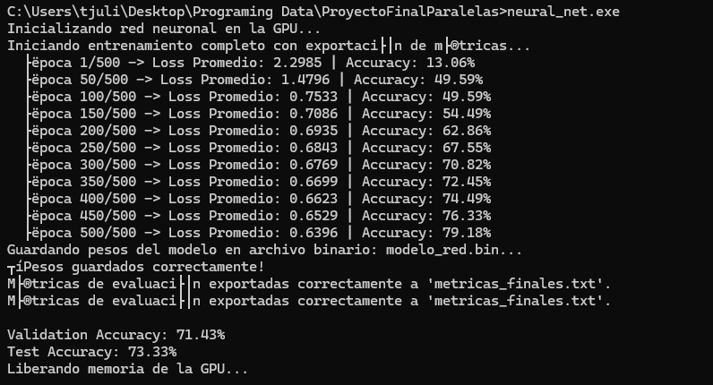

---

### F1-Score y otras métricas - GPU

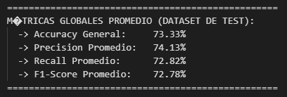

---

### Matriz de Confusión - GPU

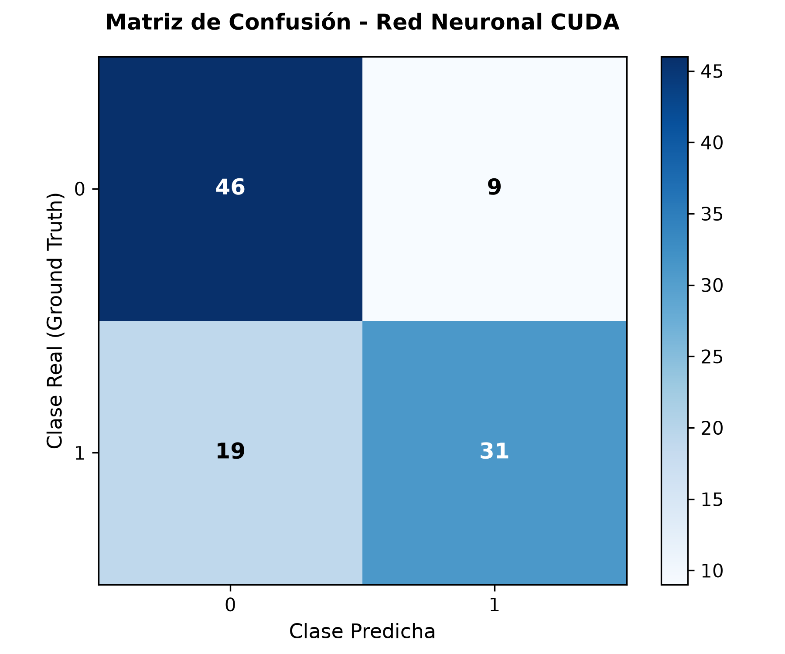

---

## Resumen del Modelo

| Característica | Valor |
|---------------|-------|
| Tipo de red | Red neuronal completamente conectada (MLP) |
| Framework | CUDA C/C++ |
| Resolución de entrada | 64 × 64 |
| Tamaño de entrada | 4096 |
| Neuronas ocultas | 256 |
| Clases de salida | 10 |
| Activación oculta | ReLU |
| Activación salida | Softmax |
| Función de pérdida | Cross-Entropy |
| Tasa de aprendizaje | 0.01 |
| Épocas de entrenamiento | 500 |
| Dataset total | 700 imágenes |
| Entrenamiento | 490 imágenes |
| Validación | 105 imágenes |
| Prueba | 105 imágenes |
| Parámetros entrenables | 1 051 136 |

---

## Implementación

La implementación fue desarrollada en CUDA, aprovechando el procesamiento paralelo de la GPU para acelerar las operaciones de propagación hacia adelante (Forward Propagation), retropropagación (Backpropagation) y actualización de pesos.

Entre los kernels implementados se encuentran:

- Multiplicación de matrices.
- Función ReLU.
- Función Softmax.
- Cálculo de la pérdida Cross-Entropy.
- Retropropagación del error.
- Cálculo del gradiente.
- Actualización de pesos.

Esta estrategia permite reducir significativamente el tiempo de entrenamiento en comparación con una implementación secuencial ejecutada únicamente sobre CPU.

## Curvas de entrenamiento

### Exactitud (Accuracy) y Loss (Perdida) - GPU

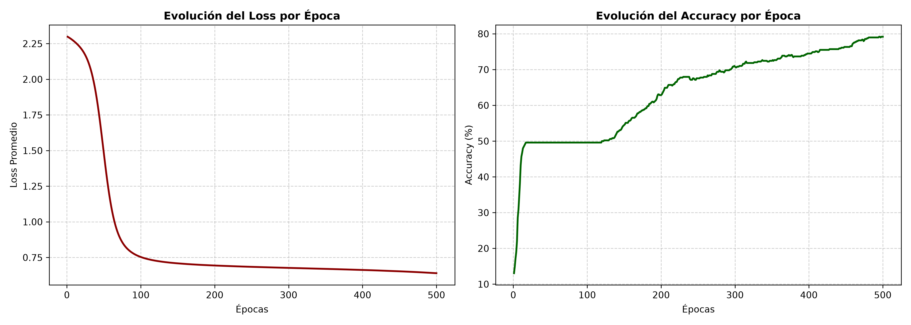

---

### Exactitud (Accuracy) y Loss (Perdida) - CPU

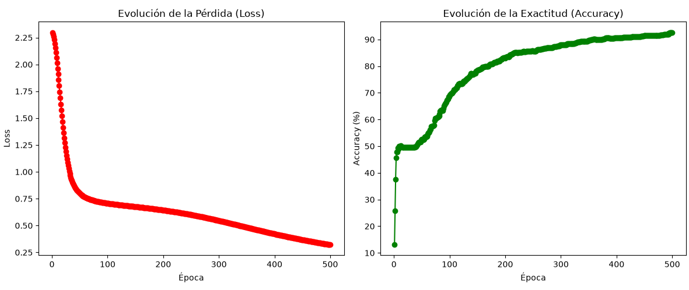

---

## Rendimiento paralelo
### Tabla de tiempos: Secuencial vs. OpenMP (Etapa 1)

| Hilos | Tiempo (s) | Speedup | X veces más rápido |
| --- | --- | --- | --- |
| 1 | 16,861 | 1 | 1.00× |
| 2 | 7,43 | 2,26931 | 2.27× |
| 4 | 7,381 | 2,28438 | 2.28× |
| 6 | 7,237 | 2,32983 | 2.33× |
| 8 | 6,633 | 2,54199 | 2.54× |

### CPU vs GPU (Etapa 2) y Speedup

Para evaluar la eficiencia del entrenamiento, se comparó la implementación paralela en CPU (OpenMP) frente a la implementación acelerada por hardware en GPU (CUDA).

| Arquitectura | Tiempo de Entrenamiento (s) | Speedup (vs. CPU) |
| :--- | :---: | :---: |
| **CPU (8 Hilos)** | 955.6160 s | 1.00x |
| **GPU (RTX 3050)** | **2.0000 s** | **477.81x** |

#### Análisis de Resultados
* **Eficiencia:** La transición de un entorno de procesamiento multihilo en CPU a una arquitectura de procesamiento masivo en GPU permitió una reducción drástica del tiempo de entrenamiento.
* **Speedup obtenido:** Se logró una aceleración de **477.81x**. Este incremento exponencial en el rendimiento es característico de las operaciones matriciales de alta densidad (como el *forward* y *backward pass* de una red neuronal), las cuales están optimizadas para ejecutarse en miles de núcleos CUDA simultáneamente.


## Evidencias
### Tiempos Secuencial vs Paralelo y Speedup

### Tiempos
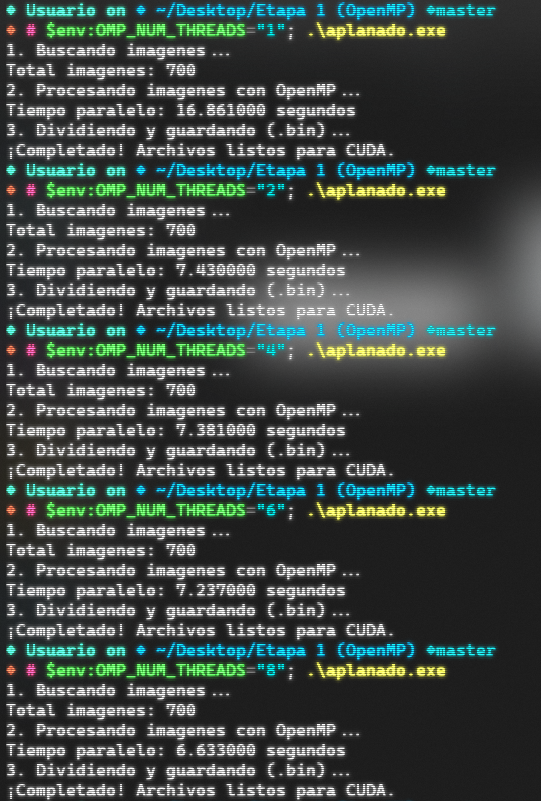

### Tabla Speedup 
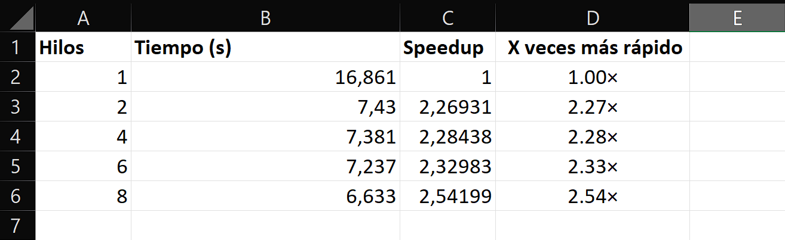

### Grafica


## Conclusiones

### Preguntas de reflexion (Etapa 1)

### 1. ¿Por qué este preprocesamiento es “vergonzosamente paralelo”? Den una analogía.

Este preprocesamiento es vergonzosamente paralelo porque cada imagen del dataset puede procesarse de forma completamente independiente. En el código, OpenMP distribuye las imágenes entre varios hilos mediante:

```C
#pragma omp parallel for
for (int i = 0; i < total_imagenes; i++) {
    process_image(rutas[i], dataset_features[i]);
}
```

Cada hilo ejecuta todo el pipeline (escala de grises, resize, filtro Gaussiano, Sobel, downsampling y normalización) sobre una imagen diferente, sin necesidad de intercambiar información con los demás hilos. Esto minimiza la sincronización y permite aprovechar varios núcleos del procesador.

Analogía:
Es como tener una pila de 8.000 fotografías para editar y repartirlas entre varios estudiantes. Cada estudiante recibe un conjunto de fotos y les aplica exactamente los mismos filtros. Ninguno necesita esperar a los demás ni compartir resultados durante el trabajo, por lo que todos pueden trabajar simultáneamente.


### 2. Si tienen 8 hilos pero el speedup se queda en 2.54×, ¿qué lo limita?


Aunque el procesamiento de imágenes es altamente paralelizable, los resultados muestran que al aumentar los hilos más allá de 2, la mejora es pequeña. Esto indica que el programa está limitado por factores distintos al número de hilos.

Según la Ley de Amdahl, la aceleración total está limitada por la fracción secuencial del programa. Además, en este caso existen otros cuellos de botella importantes:

Lectura de imágenes desde el disco.
Acceso simultáneo a archivos por varios hilos.
Gestión y sincronización de hilos OpenMP.
Limitaciones del ancho de banda de memoria.
Sobrecarga asociada a cargar cada imagen con stbi_load().

Los resultados muestran que pasar de 2 a 4 hilos apenas reduce el tiempo (7.43 s → 7.38 s), lo que sugiere que el sistema deja de estar limitado por la CPU y comienza a estar limitado principalmente por la entrada/salida (I/O) y el acceso a memoria.

Por ello, aunque se utilicen 8 hilos, el speedup obtenido es de aproximadamente 2.54×, muy inferior al speedup ideal de 8×.

### 3. Hagan un diagrama (Excalidraw) del flujo de una imagen desde foto cruda hasta vector de 4.096.

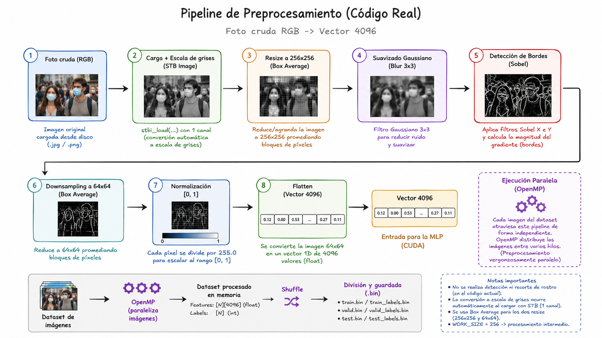

# Preguntas de Reflexión (Etapa 2)

## 1. ¿Por qué la multiplicación de matrices es ideal para la GPU? ¿Cuántos hilos lanzan y qué calcula cada uno?

La multiplicación de matrices es una operación altamente paralelizable, ya que el cálculo de cada elemento de la matriz resultado es independiente de los demás. Esto permite distribuir el trabajo entre miles de hilos de ejecución en la GPU, aprovechando su arquitectura masivamente paralela.

En la implementación realizada en CUDA, se utiliza un kernel donde **cada hilo calcula un único elemento de la matriz de salida**. Para ello, el hilo obtiene su posición mediante los índices `(row, col)` y realiza el producto punto entre la fila correspondiente de la primera matriz y la columna correspondiente de la segunda.

De forma general, cada hilo ejecuta la siguiente operación:

```text
C[i][j] = Σ A[i][k] × B[k][j]
```

Esta estrategia permite que miles de elementos de la matriz se calculen simultáneamente, reduciendo significativamente el tiempo de ejecución frente a una implementación secuencial en CPU.

---

## 2. Una capa densa es un matmul. Entonces, ¿qué estaba haciendo PyTorch por dentro en el corte anterior?

Una capa densa (Fully Connected Layer) consiste fundamentalmente en una multiplicación de matrices seguida de la suma de un sesgo (bias) y la aplicación de una función de activación.

Cuando anteriormente se utilizó PyTorch, estas operaciones eran ejecutadas automáticamente por la biblioteca sin necesidad de implementarlas manualmente. Internamente, PyTorch realiza operaciones equivalentes a:

```python
Salida = Activación(Entrada × Pesos + Bias)
```

Si el entrenamiento se ejecuta sobre una GPU, PyTorch delega estas operaciones a bibliotecas altamente optimizadas como **cuBLAS** para la multiplicación de matrices y **cuDNN** para otras operaciones relacionadas con redes neuronales.

En este proyecto, dichas operaciones fueron implementadas manualmente mediante CUDA, permitiendo comprender con mayor detalle cómo se realiza la propagación hacia adelante (Forward Propagation), la retropropagación (Backpropagation) y la actualización de pesos directamente sobre la GPU.

---

## 3. ¿En qué punto el speedup CPU→GPU se nota más: con pocos datos o con muchos? ¿Por qué?

La aceleración obtenida al utilizar una GPU se aprecia principalmente cuando se trabaja con grandes cantidades de datos o modelos de mayor tamaño.

Cuando el volumen de información es pequeño, el tiempo requerido para copiar datos entre la memoria principal (CPU) y la memoria de la GPU, además del costo de lanzar los kernels, puede ser comparable o incluso superior al tiempo de realizar los cálculos directamente en la CPU. En estos casos, la diferencia de rendimiento suele ser reducida.

En cambio, al aumentar el tamaño del conjunto de datos o el número de operaciones matemáticas, la GPU puede distribuir el trabajo entre miles de hilos ejecutándose en paralelo. De esta manera, el costo inicial de transferencia y lanzamiento de kernels se amortiza rápidamente, obteniéndose una aceleración considerable respecto a la CPU.

En este proyecto, aunque el conjunto de datos contiene **700 imágenes de 64 × 64 píxeles**, el beneficio de la GPU comienza a evidenciarse especialmente durante las operaciones repetitivas del entrenamiento, como las multiplicaciones de matrices y el cálculo de gradientes a lo largo de múltiples épocas. En problemas de mayor escala, con decenas de miles o millones de imágenes, la diferencia de rendimiento entre CPU y GPU sería aún más significativa.
